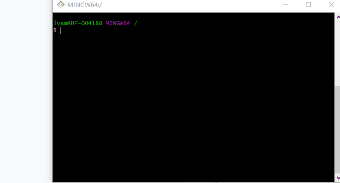
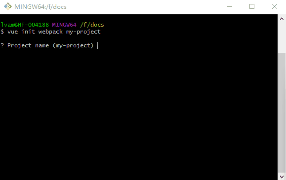
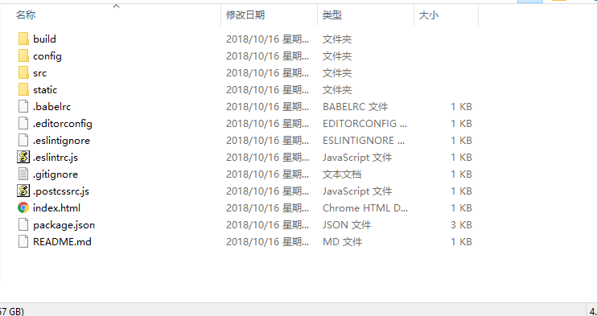

## 安装

### `<script>`引入

例如

```html
<script src='[vue文件路径]'></script>
```
不使用脚手架使用示例

``` html
    <html>
        <head>
            <title>vue</title>
        </head>
        <body>
            <div id='app'>{{msg}}</div>
            <script src="http://unpkg.com/vue/dist/vue.min.js"></script>
            <script>
                var vue = new Vue({
                    el: '#app',
                    data: {
                        msg: 'hello world'
                    }
                })
            </script>
        </body>
    </html>
```

### 脚手架（vue-cli）

vue提供了一个官方的脚手架 vue-cli

- vue-cli 安装

``` bash
npm install -g vue-cli
```

vue-cli安装完成之后控制台会多一个vue命令, 如下：



- 使用vue-cli初始化一个vue项目

```bash
vue init webpack my-project
```


生成如下




## vue启程

每个vue应用都是通过Vue函数创建实例开始

```javascript
 new Vue({
     components: {component1, component2, ...}
 })
```

vue应用是由众多vue组件组成


### 组件

组件编写

```javascript
var component =  {
    template: '<div>...</div>'
    ...
}
```

```html
<template>
    <div>
        ...
    </div>
</template>
<script>
    export default {
        ...
    }
</script>
```

组件注册

```html
<!--A1.vue 组件A1文件-->
<template>
    <div>
        {{msg}}
    </div>
</template>
<script>
    export default({
        data() {
            return {}
        }
    })
</script>
```

- 全局注册

```js
import A1 from './A1'
Vue.componet('A1', A1)
```

- 局部注册

```html
<!--组件B-->
<template>
    <div>
        <a1></a1>
    </div>
</template>
<script>
    import A1 from './A1'
    export default ({
        components: {A1},
        ...
    }) 
</script>
```
